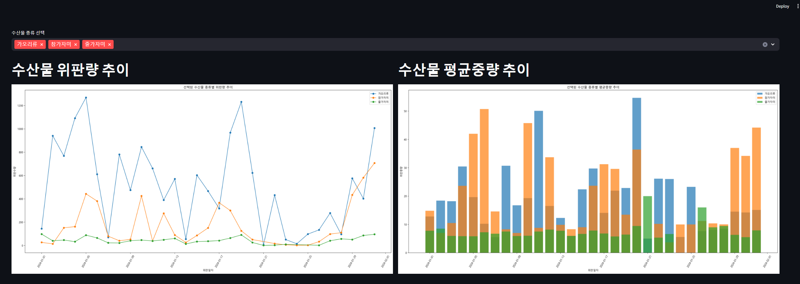

# FisherySalesView

## 추가 할 내용들

### 1번 페이지
* 어종을 고르면 아래있는 그래프들이 변경됨
* 위판일자  위판수량 꺾은선 그래프,위판중량 막대 그래프
* 
### 2번 페이지
* 맨위에 지도를 표시하고 위판장 위치(산지위판장 데이터활용)마다 마커를생성
* 아래쪽에 위판장별 어종 상태에따라 히트맵 그래프
* 업종별로 어느 어종이 가장 큰비율을 차지하는지 원형 그래프로 표시
### 3번 페이지(시간여유가 되면 추가)
* 위판중량 별 위판금액을 산점도로 표시
* 위판금액 대비 어종을 막대 그래프로 표시
* 

--- 
2024/03/14
* 1page 초안 완성
* 위판일자 데이터를 문자열이아닌 데이트타임타입으로 변경/위판일자가 다안채워진 자료를 부른후 더양이많은 자료를 불렀을때 꺾은선 그래프가 꼬이는 문제 해결
* 
---
2024/03/15
* 2page 지도,마커추가
* 히트맵 추가(어종상태 선택시 히트맵 표시로 변경예정/변경완료,산지조합의 개수가 많으면 인덱스에 전부다 표시되지않는 경우가있음/해결)
* 원그래프추가(레이블들이 서로 곂치는 문제있음)
---
